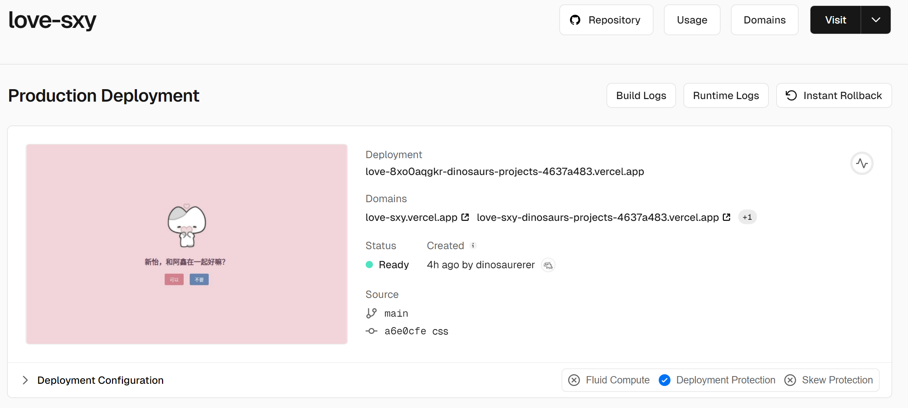

# 💖 可以做我的恋人吗？💖

这是一个 **浪漫的表白网页** 🎉，当 TA 试图点击 **“不要”** 按钮时，**“可以”** 按钮会 **变大**，而 **“不要”** 按钮会 **变小**，最终让 TA 只能选择 **“可以”**，进入甜蜜的告白界面 💕。

---


---

## 🌟 功能介绍
- **表白界面**：展示可爱的爱心图片和表白文字 💖。
- **交互按钮**：
  - 点击 **“可以”**：进入 **甜蜜告白页面** 🎊。
  - 点击 **“不要”**：**“可以”按钮变大**，**“不要”按钮变小**，让 TA 只能选择 “可以” 😂。
- **表白成功动画**：屏幕变成粉红色，并显示 **拥抱/合照图片** 📸。
- **动态特效**：渐入渐出动画，让整个体验更 **温馨有趣** ✨。

---

## 🎨 技术栈
- **HTML**：页面结构  
- **CSS**：样式和动画  
- **JavaScript**：交互逻辑（按钮变大变小、页面切换等）  

---

## 📦 项目结构
```
📁 表白项目
│── index.html    # 主页面
│── style.css     # 页面样式
│── script.js     # 交互逻辑
│── images/       # 存放图片资源
│   ├── heart.png       # 主页的爱心图片
│   ├── hug.png         # 拥抱成功图片
│   ├── love.png        # 甜蜜合照图片
│   ├── preview.png     # 预览图
```

---

## 🚀 运行方法
1. **下载/克隆** 项目：
   ```bash
   git clone https://github.com/dinosaurerer/shanny.git
   ```
2. **vscode中安装open in browser插件运行 `index.html`**，即可在浏览器中运行 💖。

---

## 🎭 交互效果
### **💡 "不要" 按钮的特殊机制**
- **点击“不要”时**：
  - “可以” 按钮 **变大** 📈。
  - “不要” 按钮 **变小** 📉。
  - 视觉引导 TA **只能选择 “可以”** 💕。

### **✨ 表白成功**
- **点击“可以”后**：
  - 背景变粉红色 🌸。
  - 显示 **“喜欢你!! ( >᎑<)♡︎”** 的可爱文字。
  - **心动图片** 出现，例如 **拥抱/合照** 📸。

---

## 📜 许可证
本项目采用 MIT 许可证，你可以自由修改和使用，欢迎 Star 🌟！
